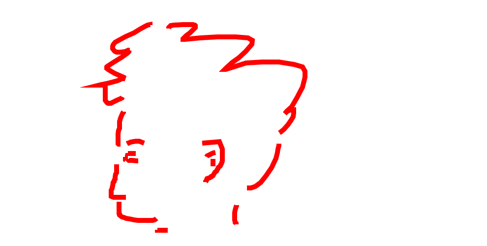

## 产品创意
>### 灵感来源
>><br>在我们的学习与工作中，总是免不了跟图打交道，比如我们看一本小说，可以通过画图来理清故事里面的人物关系，读完一篇科技文献，可以画图来表示事物之间的概念与逻辑关系；工作中的业务关系也可以用图来表示其中的流程与逻辑关系。有研究表明，在人脑的认知中，对图形的敏感程度要高于对文字的敏感程度，图表可以用简单的线条与图形将需要复杂文字表述的关系清晰地展现出来，加速人们对事物的认知。随着互联网的不断发展，教育也逐渐朝着信息化的方向发生了巨大的改变；网络在线课程的出现很大程度上改变了教育的方式，为学习者提供了学习各种知识的途径，促进了学习终身化与教育信息化发展。但目前的网络在线课程都是教师将课程放在网络平台上，学习者根据自己的需要选择性的学习。<br>
>### 目标群体
>><br>我们认为在这样的学习过程中，教师与学习者之间缺乏实时互动，不利于教学的进展；教师也不能及时获得反馈了解学习者的学习情况，为学生提供个性化的教学，学习者的问题在学习过程中也难以得到解决，使得网络在线课程的教学效率远不如传统教育。同时，人与人之间的协作能力也越来越受到人们的重视，在信息化的背景下如何增强人的协作能力，也成为了一大难题。
>### 创意过程
>><br>我们想到要搭建一个不仅可以多人在线协作画图，而且可以实现实时在线远程演示的网络平台；业务工作人员可以在线构建业务流程图，学生可以在线合作画阅读概念图，物理或数学等教师可以在线远程上课，与学生进行实时沟通并及时解决学习问题。所以，我们的平台包括了以下几个部分（如图）：<br><div align=center></div>
<br>我们需要完成登录、注册、新建文件、使用模板、插入图片、文件编辑、文件搜索、文件删除、文件保存、删除好友、搜索添加好友、文字聊天、语音视频、在线画布和文件回收站等功能。其中在新建文件创建的画布中进行文件的编辑、多人在线协作、保存文件和语音视频通话是最重要的也是最难实现的功能。<br>
<br>

## 创意
>我们经常玩你画我猜的游戏，在这个游戏里，每个人的手机上都会有一张画布，画的人可以在上面进行涂鸦，而猜的人可以看见画的人的图像，自己却不能操作，也不能方便地与朋友交流。根据这一现象，于是我们就想到了是否可以做一个一张画布多人在线实时操作的平台，并且在操作过程中添加与好友语音视频聊天的功能，方便好友之间的交流。

## 网站原型
><br>**网站介绍**。我们会在网站首页加入视频来介绍我们网站提供给哪些功能，以及用户如何使用我们的网站。通过视频、图片展示和必要的文字说明让用户对我们的网站产生兴趣，然后可以注册使用我们的网站。<br><br>
<br><br><hr>**登录和注册**。用户进入个人课程模块需要网站的邮箱账户和密码，登录功能需要识别账号是否是邮箱，用户可以自己注册账号。<br><br>
<br><br><hr>**新建文件**。用户可以新建空白文件在画布内进行操作，也可以使用自己的模板进行创作。<br><br>
<br><br><hr>**插入图片**。用户在创作过程中可以点击添加图片，从本地文件中添加图片到文件中，并且在创作过程中可以呼叫好友协作。<br><br>
<br><br><hr>**呼叫好友**。用户可以通过好友管理界面或者文件编辑界面点击呼叫好友，选中好友与好友进行协作。<br><br>
<br><br><hr>**文件管理**。文件的编辑指在画布上进行画图或者演示的操作，同时可以根据文件名称搜索文件，保存文件与删除文件的操作，用户还可以将文件保存到本地文件夹中。<br><br>
<br><br><hr>**好友管理**。在好友列表中用户可以删除自己的好友，也可以选择好友给好友发文字消息或者邀请好友协同创作，并且与好友进行语音视频聊天。<br><br>
<br><br><hr>**在线画布、语音视频**。多名用户可以同时在线编辑一个文件，并且在画布中对内容进行添加、修改和删除。同时，用户在好友界面或者文件编辑界面可以邀请好友进行语音和视频的在线交流。<br><br>
<br><br><hr>**文件回收站**。用户删除的文件会暂时放进回收站，不会永久地删除，用户进入回收站可以恢复放进回收站的文件，也可以将回收站的文件永久删除。


## 我在创意阶段所做的贡献
>在创意阶段，我通过查找资料和部分产品的体验了解线上实时协作与交流的现状，对传统的单机平台与在线协作平台进行对比，发现在线协作平台对用户协作能力培养的优越性以及协作工作的时效性；并通过对部分人的调查发现，在线协作可以提高小组学习的效率，改善学习者的学习方式；对于教学来说，实时的在线交流与演示有利于远程及时解决学习者的学习问题，提高教学效率。所以在提出了实时在线协作与交流的需要之后，我对我们初步的web网页界面板块设计进行了简单的分化，综合各大社交与教育软件预想了简单的功能板块，对网页的原型进行了初步的设计。

## 需求分析
><br>我们开发的是免费的在线网页版作图工具，名为WebRTC，将通讯工具、认知工具以及学习空间集使用起来，比单纯使用ＱＱ、Visio、其他虚拟学习空间更具优势，非常简单有效。其优点如下：<br>
<br>1) &nbsp;资源管理<br><br>WebRTC有丰富的文件管理功能。你注册一个WebRTC账号之后，你就可以随时使用和保存自己的文件，而不必担心文件丢失。导航栏中新建文件、个人文件、协作文件和回收站让文件资源的查找和整理变得异常简单，用户可以创建新的空白的文件；可以创建带有模板的新文件；可以打开个人文件，并对旧文件进行查看、修改、删除、分享；可以打开协作文件，并对之前的文件进行查看、修改、分享等；可以对文件进行搜索；可以删除文件并在回收站中还原；甚至可以在文件中插入本机上的图片。<br>
<br>2) &nbsp;实时交流<br><br>用户可以加入创建的公共小组，或者创建自己的私人小组，并邀请协作成员加入。在协作学习中，小组成员可以利用WebRTC的提供的语音视频通话即时交流、互相讨论，不仅仅通过文字来进行交流，文字交流具有耗时性和延时性，通过语音和视频可以使小组成员更快更了解其他成员的状态和想法，这样能更好的对知识进行深入学习，与此同时，基于HTML5 技术做到无延迟协作，方便两个或多个人同时对一个文件协作编辑和沟通共同制作概念图，不仅能够提高效率，还可以增进成员中的团结意识。<br>
<br>3) &nbsp;操作简单<br><br>注册简单。只需要输入一个邮箱地址和用户名密码即可，或者通过第三方账号登录；可以建立空白文档，也可以根据自己的需要选择合适的模板，根据提示操作即可；制作概念图时既可以直接把需要的图形拖拽到画布编辑，也可以自主画图；采用实时保存机制，每一步操作之后都自动保存，做完之后你可以保存图片，然后插入到其他文件中，方便简单又实用，而且也会让作品看起来更加专业；能够快速还原误删除的文件。     

## 设计的功能列表以及其完成情况

 设计的功能|承担该功能的组员|任务完成度
 --|--|--
  登录注册|李敏|100%
  视频文档介绍|李敏|100%
  搜索文件|李敏|100%
  新建保存文件|李敏|100%
  插入图片|李敏|100%
  加好友|崔红洋|50%
  搜索好友|崔红洋|50%
  回收站|崔红洋|100%
  个人文件管理|崔红洋|100%
  编辑图片|崔红洋|100%
  协作文件管理|崔红洋|100%
  视频通信|吴清泽|90%
  写字板同步|吴清泽|90%

## 产品技术方案
> 我的主要工作是基于 socket.io,Angular框架实现客户端和服务器的数据通信。<br><br>
**客户端**<br>
为需要的html元素进行数据绑定,利用angular的依赖注入特性实现客户端元素和后台的数据进行绑定，从而避免大量重复的dart代码的书写。<br><br>
**服务端**<br>
1、基于 socket.io接听写字板的数据变换，及时通知接收方进行写字板的数据更新。<br>
2、数据库的增删改查的工作大部分都是我完成的<br>
3、数据库的表的设计也是我做的，考虑到大量复杂的逻辑，数据库中的表的设计确实要花很大的脑子，比如说为了避免数据的冗余，对数据库的设计要基于范式的设计
## 我在小组中的分工
>我的主要工作是基于 socket.io,Angular框架实现客户端和服务器的数据通信。我认为我们组长吴清泽是我们组里贡献最大的，他不仅解决项目中的大部分问题，同时也很热心地帮助我们解决我们遇到的问题。通过这个web项目开发，我学到了很多，不仅是技术上的，同时也意识到了团队合作的重要性。

   组员|分数
 --|--
  李敏|9
  崔红洋|9
  吴清泽|10

## 我的编程实践活动
### 我的代码
>
```html
<!--friend_box module-->
<div class="row clearfix">
    <div class="col-md-12 column">
        <div class="row">
            <div class="col-md-4" ng-repeat="person in search_friend" ng-hide="search_friend.length == 0">
                <div class="thumbnail">
                    
                    <div class="caption">
                        <h3>
                            {{person['name']}}
                        </h3>
                        <p>
                            {{person['qianming']}}
                        </p>
                        <p>
                            <div class="row clearfix">
                                <div class="col-md-2 column">
                                    <a class="btn btn-primary" href="#">call</a>
                                </div>
                                <div class="col-md-3 column">
                                    <a class="btn btn-default" href="#">发消息</a>
                                </div>
                                <div class="col-md-3 column">
                                </div>
                                <div class="col-md-4 column">
                                        <a class="btn btn-danger" href="#">删除好友</a>
                                </div>
                            </div>
                        </p>
                    </div>
                </div>
            </div>
            <div class="col-md-4" ng-repeat="person in lasted_friend" ng-hide="search_friend.length != 0">
                <div class="thumbnail">
                    
                    <div class="caption">
                        <h3>
                            {{person['name']}}
                        </h3>
                        <p>
                            {{person['qianming']}}
                        </p>
                        <p>
                            <div class="row clearfix">
                                <div class="col-md-2 column">
                                    <a class="btn btn-primary" href="#">call</a>
                                </div>
                                <div class="col-md-3 column">
                                    <a class="btn btn-default" href="#">发消息</a>
                                </div>
                                <div class="col-md-3 column">
                                </div>
                                <div class="col-md-4 column">
                                        <a class="btn btn-danger" href="#">删除好友</a>
                                </div>
                            </div>
                        </p>
                    </div>
                </div>
            </div>
        </div>
    </div>
</div>
```
```html
<!--friend_panel module-->
<div ng-controller="friend_panel" ng-hide="friend_panel_hide">
    <form class="navbar-form navbar-left" role="search">
        <div class="form-group">
            <input type="text" class="form-control" />
        </div> <button type="submit" class="btn btn-default">Submit</button>
    </form>

    <div class="row clearfix">
        <div class="col-md-12 column">
            <div class="row">
                <div class="col-md-4">
                    <div class="thumbnail">
                        
                        <div class="caption">
                            <h3>
                                Thumbnail label
                            </h3>
                            <p>
                                Cras justo odio, dapibus ac facilisis in, egestas eget quam. Donec id elit non mi porta gravida at eget metus. Nullam id dolor id nibh ultricies vehicula ut id elit.
                            </p>
                            <p>
                                    <a class="btn btn-primary" href="#">Action</a> <a class="btn" href="#">Action</a>
                            </p>
                        </div>
                    </div>
                </div>
                <div class="col-md-4">
                    <div class="thumbnail">
                        
                        <div class="caption">
                            <h3>
                                Thumbnail label
                            </h3>
                            <p>
                                Cras justo odio, dapibus ac facilisis in, egestas eget quam. Donec id elit non mi porta gravida at eget metus. Nullam id dolor id nibh ultricies vehicula ut id elit.
                            </p>
                            <p>
                                    <a class="btn btn-primary" href="#">Action</a> <a class="btn" href="#">Action</a>
                            </p>
                        </div>
                    </div>
                </div>
                <div class="col-md-4">
                    <div class="thumbnail">
                        
                        <div class="caption">
                            <h3>
                                Thumbnail label
                            </h3>
                            <p>
                                Cras justo odio, dapibus ac facilisis in, egestas eget quam. Donec id elit non mi porta gravida at eget metus. Nullam id dolor id nibh ultricies vehicula ut id elit.
                            </p>
                            <p>
                                    <a class="btn btn-primary" href="#">Action</a> <a class="btn" href="#">Action</a>
                            </p>
                        </div>
                    </div>
                </div>
            </div>
        </div>
    </div>
</div>

```
```html
<!--icons module-->
<div id="icons" class="">
    <svg id="mute-audio" xmlns="http://www.w3.org/2000/svg" width="48" height="48" viewBox="-10 -10 68 68">
    <title>title</title>
      <circle cx="24" cy="24" r="34">
        <title>Mute audio</title>
      </circle>
      <path class="on" transform="scale(0.6), translate(17,18)" d="M38 22h-3.4c0 1.49-.31 2.87-.87 4.1l2.46 2.46C37.33 26.61 38 24.38 38 22zm-8.03.33c0-.11.03-.22.03-.33V10c0-3.32-2.69-6-6-6s-6 2.68-6 6v.37l11.97 11.96zM8.55 6L6 8.55l12.02 12.02v1.44c0 3.31 2.67 6 5.98 6 .45 0 .88-.06 1.3-.15l3.32 3.32c-1.43.66-3 1.03-4.62 1.03-5.52 0-10.6-4.2-10.6-10.2H10c0 6.83 5.44 12.47 12 13.44V42h4v-6.56c1.81-.27 3.53-.9 5.08-1.81L39.45 42 42 39.46 8.55 6z" fill="white"></path>
      <path class="off" transform="scale(0.6), translate(17,18)" d="M24 28c3.31 0 5.98-2.69 5.98-6L30 10c0-3.32-2.68-6-6-6-3.31 0-6 2.68-6 6v12c0 3.31 2.69 6 6 6zm10.6-6c0 6-5.07 10.2-10.6 10.2-5.52 0-10.6-4.2-10.6-10.2H10c0 6.83 5.44 12.47 12 13.44V42h4v-6.56c6.56-.97 12-6.61 12-13.44h-3.4z" fill="white"></path>
    </svg>
    <br>
    <svg id="mute-video" xmlns="http://www.w3.org/2000/svg" width="48" height="48" viewBox="-10 -10 68 68">
      <circle cx="24" cy="24" r="34">
        <title>Mute video</title>
      </circle>
      <path class="on" transform="scale(0.6), translate(17,16)" d="M40 8H15.64l8 8H28v4.36l1.13 1.13L36 16v12.36l7.97 7.97L44 36V12c0-2.21-1.79-4-4-4zM4.55 2L2 4.55l4.01 4.01C4.81 9.24 4 10.52 4 12v24c0 2.21 1.79 4 4 4h29.45l4 4L44 41.46 4.55 2zM12 16h1.45L28 30.55V32H12V16z" fill="white"></path>
      <path class="off" transform="scale(0.6), translate(17,16)" d="M40 8H8c-2.21 0-4 1.79-4 4v24c0 2.21 1.79 4 4 4h32c2.21 0 4-1.79 4-4V12c0-2.21-1.79-4-4-4zm-4 24l-8-6.4V32H12V16h16v6.4l8-6.4v16z" fill="white"></path>
    </svg>
    <br>
    <svg id="fullscreen" xmlns="http://www.w3.org/2000/svg" width="48" height="48" viewBox="-10 -10 68 68" class="on">
      <a id="quit">
      <circle cx="24" cy="24" r="34">
        <title>Exit fullscreen</title>
      </circle>
      </a>
      <path class="on" transform="scale(0.8), translate(7,6)" d="M10 32h6v6h4V28H10v4zm6-16h-6v4h10V10h-4v6zm12 22h4v-6h6v-4H28v10zm4-22v-6h-4v10h10v-4h-6z" fill="white"></path>
      <path class="off" transform="scale(0.8), translate(7,6)" d="M14 28h-4v10h10v-4h-6v-6zm-4-8h4v-6h6v-4H10v10zm24 14h-6v4h10V28h-4v6zm-6-24v4h6v6h4V10H28z" fill="white"></path>
    </svg>
    <br>
    <svg id="hangup" xmlns="http://www.w3.org/2000/svg" width="48" height="48" viewBox="-10 -10 68 68">
      <circle cx="24" cy="24" r="34">
        <title>Hangup</title>
      </circle>
      <path transform="scale(0.7), translate(11,10)" d="M24 18c-3.21 0-6.3.5-9.2 1.44v6.21c0 .79-.46 1.47-1.12 1.8-1.95.98-3.74 2.23-5.33 3.7-.36.35-.85.57-1.4.57-.55 0-1.05-.22-1.41-.59L.59 26.18c-.37-.37-.59-.87-.59-1.42 0-.55.22-1.05.59-1.42C6.68 17.55 14.93 14 24 14s17.32 3.55 23.41 9.34c.37.36.59.87.59 1.42 0 .55-.22 1.05-.59 1.41l-4.95 4.95c-.36.36-.86.59-1.41.59-.54 0-1.04-.22-1.4-.57-1.59-1.47-3.38-2.72-5.33-3.7-.66-.33-1.12-1.01-1.12-1.8v-6.21C30.3 18.5 27.21 18 24 18z" fill="white"></path>
    </svg>

</div>
```
```html
<!--image_panel module-->
<div ng-controller="image_panel_controller" ng-hide="image_panel_hide">
    <form role="form">
        <div class="form-group">
                <label for="exampleInputFile">File input</label><input type="file" id="exampleInputFile" />
            <p class="help-block">
                Example block-level help text here.
            </p>
        </div>
        <button type="submit" class="btn btn-default">Submit</button>
    </form>
    <div id="draw_panel"></div>
    
    
    <form id="imgForm">  
            <input type="file" class="addBorder">  
            <br/>  
            <button type="button" onclick="load_then_draw()">获取图片</button>  
    </form> 
</div>

```
```html
<!--index.html module-->
<!DOCTYPE HTML PUBLIC "-//W3C//DTD HTML 4.01//EN" "http://www.w3.org/TR/html4/strict.dtd">
<html lang="en">
<head>
    <meta http-equiv="Content-Type" content="text/html;charset=UTF-8">
    <title>canvas</title>
    <style type="text/css">
        body{height:100%;}
        a:link, a:visited{color:#333;text-decoration:none;}
        .con1,.con2{position:relative;border:#ccc solid 1px;width:400px;height:400px;float:left;margin-right:5px;}
        .con1{width:990px;height:500px;}
        .handler1, .handler2{width:40px;height:400px;border:#ccc solid 1px;float:left;margin-right:25px;}
        .handler1 a, .handler2 a{border-bottom:#ccc solid 1px;height:30px;line-height:30px;font-size:12px;display: block;text-align:center;}
        .handler1 a.active, .handler2 a.active{background:#ddd;}
        input{width:30px;}
        .handler1 span, .handler2 span{width:10px;height:10px;margin:1px;display:block;border:#fff solid 1px;}
        .handler1 span.active, .handler2 span.active{width:10px;height:10px;margin:1px;display:block;border-color:red;}
    </style>
    
</head>
<body style="">
<div class="con1">

</div>
<div class="handler1">
    <a class="rect" href="javascript:;">矩形</a>
    <a class="round" href="javascript:;">圆形</a>
    <a class="line" href="javascript:;">直线</a>
    <a class="curve" href="javascript:;">曲线</a>
    <a class="arrow" href="javascript:;">箭头</a>
    <a class="ease" href="javascript:;">橡皮</a>
    <a class="back" href="javascript:;">后退</a>
    <a class="forward" href="javascript:;">前进</a>
    <a class="clear" href="javascript:;">清除</a>
    <a class="save" href="javascript:;">保存</a>
    <input class="lineWidth" value="1" autocomplete="off" />
    <span style="background: red;"></span>
    <span style="background: green;"></span>
    <span style="background: blue;"></span>
    <span style="background: #000;"></span>
</div>


<div class="con2" hidden="true">

</div>
<div class="handler2" hidden="true">
    <a class="rect" href="javascript:;">矩形</a>
    <a class="round" href="javascript:;">圆形</a>
    <a class="line" href="javascript:;">直线</a>
    <a class="curve" href="javascript:;">曲线</a>
    <a class="ease" href="javascript:;">橡皮</a>
</div>

<div id="videos">
    <video id="localVideo" autoplay muted></video>
    <video id="remoteVideo" autoplay></video>
</div>

<script src="../lab/jquery.js"></script>
<script src="../lab/excanvas.js"></script>
<script src="../lab/html2canvas.js"></script>
<script src="../build/draw-board.min.js"></script>

<script>
    var panel = new DrawBoard({
        width: $('.con1').width(),
        height: $('.con1').height(),
        parent: '.con1',
        type: 'arrow',
        lineWidth: $('.handler1 .lineWidth').val(),
        color: 'red'
    });
    var panel2 = new DrawBoard({
        width: $('.con2').width(),
        height: $('.con2').height(),
        parent: '.con2',
        type: 'rect',
        color: 'red'
    });
    $('.handler1 a:not(.back,.forward), .handler2 a').click(function () {
        $(this).addClass('active').siblings().removeClass('active');
    });
    $('.handler1 a.rect').click(function () { panel.type = 'rect'; });
    $('.handler1 a.round').click(function () { panel.type = 'round'; });
    $('.handler1 a.line').click(function () { panel.type = 'line'; });
    $('.handler1 a.curve').click(function () { panel.type = 'curve'; });
    $('.handler1 a.arrow').click(function () { panel.type = 'arrow'; });
    $('.handler1 a.ease').click(function () { panel.type = 'ease'; });
    $('.handler1 a.back').click(function () { panel.back(); });
    $('.handler1 a.forward').click(function () { panel.forward(); });
    $('.handler1 .lineWidth').change(function () { panel.setLineWidth($(this).val()); });
    $('.handler1 span').click(function () {
        panel.setColor($(this).css('background-color'));
        $(this).addClass('active').siblings('span').removeClass('active');
    });
    $('.handler1 .clear').click(function() {
        panel.clear();
    });
    $('.handler1 .save').click(function() {
        panel.save();
    });

    $('.handler2 a.rect').click(function () { panel2.type = 'rect'; });
    $('.handler2 a.round').click(function () { panel2.type = 'round'; });
    $('.handler2 a.line').click(function () { panel2.type = 'line'; });
    $('.handler2 a.curve').click(function () { panel2.type = 'curve'; });
    $('.handler2 a.ease').click(function () { panel2.type = 'ease'; });
</script>
<link rel="stylesheet" href="../css/bootstrap.min.css" />
<script type="text/javascript" src="../js/jquery-3.1.1.min.js" ></script>
<script type="text/javascript" src="../js/bootstrap.min.js"></script>
<script src="/socket.io/socket.io.js"></script>
<script src="js/lib/adapter.js"></script>
<!-- <script src="js/main.js"></script> -->
<script src="../js/myMain.js"></script>

<!-- <script src="../js/main.js"></script> -->
<!-- <script>
    
    console.log("mymain.js");
    var canvas = document.getElementsByTagName('canvas')[0];
    canvas.id = "main_canvas";
    var ctx = canvas.getContext('2d');
    var canvas_imagedata = ctx.getImageData(0,0,990,500);

    var array_data = new Uint8ClampedArray(canvas_imagedata.data);

    var socket = io();

    socket.on("toserver", function(msg){
        console.log(msg);
    });
    if(window.Worker){
        var myWorker = new Worker("worker.js");
        window.setInterval(function(){
            var lasted_array = document.getElementById("main_canvas").getContext("2d").getImageData(0,0,990,500).data;
            myWorker.postMessage([array_data, lasted_array]);
        },200);

        myWorker.onmessage = function(e){
            if(e.data["isChanged"] == true){
                array_data = document.getElementById("main_canvas").getContext("2d").getImageData(0,0,990,500).data;
                array_data = new Uint8ClampedArray(array_data);
                socket.emit('toserver', JSON.stringify({'id':1,'data': e.data["changed_data"]}))
            }else{
                console.log("not changed");
            }
        }
    }
   
</script> -->
</body>
</html>
```
```html
<!--login.html module-->
<!DOCTYPE HTML PUBLIC "-//W3C//DTD HTML 4.01//EN" "http://www.w3.org/TR/html4/strict.dtd">
<html lang="en">
<head>
    <meta http-equiv="Content-Type" content="text/html;charset=UTF-8">
    <title>canvas</title>
    <style type="text/css">
        body{height:100%;}
        a:link, a:visited{color:#333;text-decoration:none;}
        .con1,.con2{position:relative;border:#ccc solid 1px;width:400px;height:400px;float:left;margin-right:5px;}
        .con1{width:990px;height:500px;}
        .handler1, .handler2{width:40px;height:400px;border:#ccc solid 1px;float:left;margin-right:25px;}
        .handler1 a, .handler2 a{border-bottom:#ccc solid 1px;height:30px;line-height:30px;font-size:12px;display: block;text-align:center;}
        .handler1 a.active, .handler2 a.active{background:#ddd;}
        input{width:30px;}
        .handler1 span, .handler2 span{width:10px;height:10px;margin:1px;display:block;border:#fff solid 1px;}
        .handler1 span.active, .handler2 span.active{width:10px;height:10px;margin:1px;display:block;border-color:red;}
    </style>
    
</head>
<body style="">
<div class="con1">

</div>
<div class="handler1">
    <a class="rect" href="javascript:;">矩形</a>
    <a class="round" href="javascript:;">圆形</a>
    <a class="line" href="javascript:;">直线</a>
    <a class="curve" href="javascript:;">曲线</a>
    <a class="arrow" href="javascript:;">箭头</a>
    <a class="ease" href="javascript:;">橡皮</a>
    <a class="back" href="javascript:;">后退</a>
    <a class="forward" href="javascript:;">前进</a>
    <a class="clear" href="javascript:;">清除</a>
    <a class="save" href="javascript:;">保存</a>
    <input class="lineWidth" value="1" autocomplete="off" />
    <span style="background: red;"></span>
    <span style="background: green;"></span>
    <span style="background: blue;"></span>
    <span style="background: #000;"></span>
</div>


<div class="con2" hidden="true">

</div>
<div class="handler2" hidden="true">
    <a class="rect" href="javascript:;">矩形</a>
    <a class="round" href="javascript:;">圆形</a>
    <a class="line" href="javascript:;">直线</a>
    <a class="curve" href="javascript:;">曲线</a>
    <a class="ease" href="javascript:;">橡皮</a>
</div>

<div id="videos">
    <video id="localVideo" autoplay muted></video>
    <video id="remoteVideo" autoplay></video>
</div>

<script src="../lab/jquery.js"></script>
<script src="../lab/excanvas.js"></script>
<script src="../lab/html2canvas.js"></script>
<script src="../build/draw-board.min.js"></script>

<script>
    var panel = new DrawBoard({
        width: $('.con1').width(),
        height: $('.con1').height(),
        parent: '.con1',
        type: 'arrow',
        lineWidth: $('.handler1 .lineWidth').val(),
        color: 'red'
    });
    var panel2 = new DrawBoard({
        width: $('.con2').width(),
        height: $('.con2').height(),
        parent: '.con2',
        type: 'rect',
        color: 'red'
    });
    $('.handler1 a:not(.back,.forward), .handler2 a').click(function () {
        $(this).addClass('active').siblings().removeClass('active');
    });
    $('.handler1 a.rect').click(function () { panel.type = 'rect'; });
    $('.handler1 a.round').click(function () { panel.type = 'round'; });
    $('.handler1 a.line').click(function () { panel.type = 'line'; });
    $('.handler1 a.curve').click(function () { panel.type = 'curve'; });
    $('.handler1 a.arrow').click(function () { panel.type = 'arrow'; });
    $('.handler1 a.ease').click(function () { panel.type = 'ease'; });
    $('.handler1 a.back').click(function () { panel.back(); });
    $('.handler1 a.forward').click(function () { panel.forward(); });
    $('.handler1 .lineWidth').change(function () { panel.setLineWidth($(this).val()); });
    $('.handler1 span').click(function () {
        panel.setColor($(this).css('background-color'));
        $(this).addClass('active').siblings('span').removeClass('active');
    });
    $('.handler1 .clear').click(function() {
        panel.clear();
    });
    $('.handler1 .save').click(function() {
        panel.save();
    });

    $('.handler2 a.rect').click(function () { panel2.type = 'rect'; });
    $('.handler2 a.round').click(function () { panel2.type = 'round'; });
    $('.handler2 a.line').click(function () { panel2.type = 'line'; });
    $('.handler2 a.curve').click(function () { panel2.type = 'curve'; });
    $('.handler2 a.ease').click(function () { panel2.type = 'ease'; });
</script>
<link rel="stylesheet" href="../css/bootstrap.min.css" />
<script type="text/javascript" src="../js/jquery-3.1.1.min.js" ></script>
<script type="text/javascript" src="../js/bootstrap.min.js"></script>
<script src="/socket.io/socket.io.js"></script>
<script src="js/lib/adapter.js"></script>
<!-- <script src="js/main.js"></script> -->
<script src="../js/myMain.js"></script>

<!-- <script src="../js/main.js"></script> -->
<!-- <script>
    
    console.log("mymain.js");
    var canvas = document.getElementsByTagName('canvas')[0];
    canvas.id = "main_canvas";
    var ctx = canvas.getContext('2d');
    var canvas_imagedata = ctx.getImageData(0,0,990,500);

    var array_data = new Uint8ClampedArray(canvas_imagedata.data);

    var socket = io();

    socket.on("toserver", function(msg){
        console.log(msg);
    });
    if(window.Worker){
        var myWorker = new Worker("worker.js");
        window.setInterval(function(){
            var lasted_array = document.getElementById("main_canvas").getContext("2d").getImageData(0,0,990,500).data;
            myWorker.postMessage([array_data, lasted_array]);
        },200);

        myWorker.onmessage = function(e){
            if(e.data["isChanged"] == true){
                array_data = document.getElementById("main_canvas").getContext("2d").getImageData(0,0,990,500).data;
                array_data = new Uint8ClampedArray(array_data);
                socket.emit('toserver', JSON.stringify({'id':1,'data': e.data["changed_data"]}))
            }else{
                console.log("not changed");
            }
        }
    }
   
</script> -->
</body>
</html>
```
```html
<!--navigator module-->
<nav class="navbar navbar-default" role="navigation" ng-controller="navigator_controller">
    <div class="navbar-header">
            <button type="button" class="navbar-toggle" data-toggle="collapse" data-target="#bs-example-navbar-collapse-1"> <span class="sr-only">Toggle navigation</span><span class="icon-bar"></span><span class="icon-bar"></span><span class="icon-bar"></span></button> <a class="navbar-brand" href="#">WebRTC</a>
    </div>
    <div class="collapse navbar-collapse" id="bs-example-navbar-collapse-1">
        <form class="navbar-form navbar-left" role="search">
            <div class="form-group">
                <input type="text" class="form-control dropdown-toggle" data-toggle="dropdown" ng-model="search_value" id="wuqingze"  placeholder="好友或文件"/>
                <ul class="dropdown-menu" ng-hide="data_list.length==0">
                    <li ng-repeat="x in data_list">
                        <div class="col-sm-6">
                            <h4>{{x["h"]}}</h4>
                            <p>{{x["p"]}}</p>
                        </div>
                        <div class="col-sm-6">
                            <a href="#" class="thumbnail">
                                
                            </a>
                        </div>
                        <hr>
                    </li>
                </ul>
            </div> 
            <button type="submit" class="btn btn-default">Submit</button>
        </form>
        <ul class="nav navbar-nav navbar-right">
            <li>
                
                <ul class="dropdown-menu">
                    <li ng-repeat="message in messages">
                        <a href="/web/draw.html" >{{message['friend']}}</a>
                    </li>
                </ul>
            </li>
            <li>
                    <!-- <a href="#" class="dropdown-toggle" data-toggle="dropdown"><strong class="caret"></strong></a> -->
                    
                <ul class="dropdown-menu">
                    <li>
                            <a href="#">Action</a>
                    </li>
                    <li>
                            <a href="#">Another action</a>
                    </li>
                    <li>
                            <a href="#">Something else here</a>
                    </li>
                    <li class="divider">
                    </li>
                    <li>
                            <a href="#">Separated link</a>
                    </li>
                </ul>
            </li>
        </ul>
    </div>
</nav>
```
```html
<!--new_file panel module-->
<div ng-controller="new_file_controller">
    <div class="row clearfix">
        <div class="col-md-2 column" style="background:rgb(248, 248, 248)" id="chose_panel">
            <ul class="nav nav-pills nav-stacked">
                <li class="{{empty_class}}" id="empty_canvas" ng-click="empty_panel_click()"><a>empty</a></li>
                <li class="{{old_class}}" id="old_canvas" ng-click="old_panel_click()"><a>old file</a></li>
                <li class="{{image_class}}" id="image_canvas" ng-click="image_panel_click()"><a>add image</a></li>
                <li class="{{friend_class}}" id="call_friend" ng-click="friend_panel_click()"><a>call friend</a></li>
                <li class="{{bin_class}}" id="recycle_bin" ng-click="bin_panel_click()"><a>recycle bin</a></li>
            </ul>
        </div>
        <div class="col-md-10 column" id="display_panel">
            
            <drawcanvas ng-hide="empty_panel_hide" ng-repeat="canvas in empty_canvas" ng-controller="empty_file_controller"></drawcanvas>

            <div ng-hide="old_file_panel_hide" ng-controller="old_file_controller">
                <form class="navbar-form navbar-left" role="search">
                    <div class="form-group">
                        <input type="text" class="form-control" ng-model="search_value"/>
                    </div> <button type="submit" class="btn btn-default">Submit</button>
                </form>
                <filebox></filebox>
                <div id="draw_panel"></div>
            </div>
            
            <div  ng-hide="image_panel_hide">
                <div class="jumbotron" ng-hide="image_select_hide">
                    <div class="container">
                        <div class="row clearfix">
                            <div class="col-md-4 column">
                            </div>
                            <div class="col-md-4 column">
                                <div class="alert alert-success alert-dismissable" style="background-color: rgb(248,248,248)">
                                    <form role="form" class="navbar-form">
                                        <div class="form-group">
                                            <input type="text" class="form-control" id="name" 
                                                    placeholder="请输入名称">
                                        </div><br/><br/>
                                            <input style="margin:0px 0px 0px 50px" type="file" id="inputfile" class="form-check-input" fileread="image_file">
                                        <br>
                                        <button ng-click="image_canvas_click()" style="margin:0px 0px 0px 50px" type="submit" class="btn btn-default">提交</button>
                                    </form>    
                                </div>
                                
                            </div>
                            <div class="col-md-4 column">
                            </div>
                        </div>
                        
                    </div>
                </div>
                <div ng-repeat="canvas in image_canvas">
                    <drawcanvas ng-controller="save_image_file_controller"></drawcanvas>
                </div>
            </div>

            <div ng-hide="friend_panel_hide" ng-controller="friend_controller">
                <form class="navbar-form navbar-left" role="search">
                    <div class="form-group">
                        <input type="text" class="form-control" ng-model="search_value"/>
                    </div> <button type="submit" class="btn btn-default">Submit</button>
                </form>
            
                <friendbox></friendbox>
            </div>
            
            <div  ng-hide="bin_panel_hide" ng-controller="new_file_bin_controller">
                <form class="navbar-form navbar-left" role="search">
                    <div class="form-group">
                        <input type="text" class="form-control" ng-model="search_value"/>
                    </div> <button type="submit" class="btn btn-default">Submit</button>
                </form>
                <binbox></binbox>
            </div>

            <div>
                <!-- <p ng-repeat="file_box in file_box_canvas">djfdfadflajf</p> -->
                <drawcanvas ng-repeat="file_box in file_box_canvas"></drawcanvas>
            </div>
    </div>
    <!-- <filebox ng-controller="file_box_controller"></filebox> -->
    <!-- <filebox ng-controller="file_box_controller_01"></filebox> -->
</div>
    
```
```html
<!--old_file module-->
<form role="form">
    <div class="form-group">
        <label for="exampleInputFile">File input</label><input type="file" id="exampleInputFile" />
        <p class="help-block">
            Example block-level help text here.
        </p>
    </div>
    <button type="submit" class="btn btn-default">Submit</button>
</form>
<div id="old_file_draw_panel" hidden="true"></div>
```
```dart
///主函数
main(){
var element;
}
///什么按钮的事件函数
void click(event e){
}

```
  
## 我的活动量化


>  **李敏/10154507113/53 commits / 49,980 ++ / 1,899 --/0 issues/**  
# 我的自评
> 在小组的在线实时协作与演示项目中，我主要负责界面搭建和功能设计的板块，完成了界面间的跳转与数据库的问题。通过对dart语言的学习与探究，我深入地学习到了网络编程的一些方法和技巧，也更加清楚了web网页创作的基本流程与步骤，清楚地认识到了一个web网页所包含的基本元素与内容，以及网络平台的运行方式和基本情况。在项目创作的过程中，我的自我学习能力、协作能力与编程能力取得了很大的进步，如果用一整天8小时时间计算，我有信心再用10天完成我目前未完成的功能以及完善已有的功能。